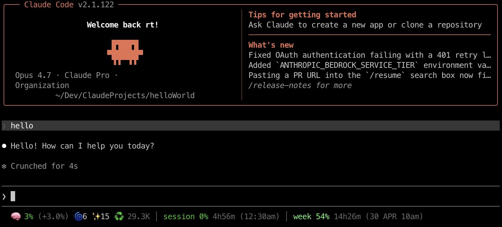

# claude-usage-in-status

A Claude Code plugin that shows live context, token, and rate limit usage in your statusline after every prompt.

## What it shows



```
🧠 57% (+2.0%) 🌀3 ✨94 ♻️ 108.8K │ session 90% 3h15m (9am) │ week 37% 4d4h (30 APR 10am)
```

| Segment | Source | Meaning |
|---------|--------|---------|
| `🧠 57%` | `context_window.used_percentage` | How full the context window is |
| `(+2.0%)` | Delta from previous turn | How much this prompt grew the context |
| `🌀3 ✨94` | `current_usage.input/output_tokens` | Fresh tokens sent and generated this turn |
| `♻️ 108.8K` | `cache_read + cache_creation` | Tokens served from / written to cache |
| `session 90% 3h15m (9am)` | `rate_limits.five_hour` | 5-hour rate limit usage + time until reset |
| `week 37% 4d4h (30 APR 10am)` | `rate_limits.seven_day` | Weekly rate limit usage + reset date/time |

All data comes directly from Claude Code's stdin — no external API calls.

## Installation

### Via marketplace

```
/plugin marketplace add rafsuntaskin/ai-plugins
/plugin install claude-usage-in-status@ai-plugins
```

### Manual

```bash
git clone https://github.com/rafsuntaskin/claude-usage-in-status ~/.claude/plugins/claude-usage-in-status
node ~/.claude/plugins/claude-usage-in-status/setup.js
```

Restart Claude Code and the statusline will appear.

## How the context delta works

The `(+2.0%)` value is the difference in `context_window.used_percentage` between the current and previous turn. State is stored in `~/.claude/usage-tracker/statusline-state.json` per session.

## Plugin structure

```
claude-usage-in-status/
├── .claude-plugin/
│   └── plugin.json
├── hooks/
│   ├── hooks.json              # Registers SessionStart hook
│   └── scripts/
│       ├── statusline.js       # Reads stdin, renders one statusline
│       └── session-start.js    # Auto-configures statusLine in settings.json
├── setup.js                    # Manual install helper (optional)
└── README.md
```

## Requirements

- Node.js 18+
- Claude Code 2.0+

## License

MIT
